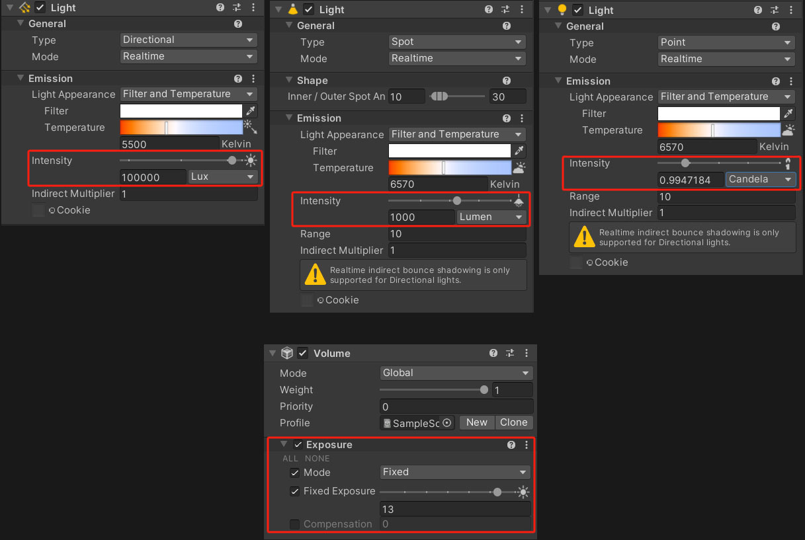
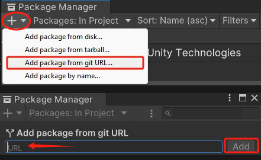

# cn.unity.physical-light-unit
## Physical Light Unit for (URP) Universal Render Pipeline

### Version support:
Universal RP version: 14.0.11+

Unity Editor version: 2022.3.55(LTS)+

### Note: The Exposure feature is not complete, currently it will just do the simple multiplier of the final Light Intensity output!

### Installation:
Add this package via Package Manager:
    
- Copy this Repository HTTPS URL to clipboard
- Open via Package Manager Window

